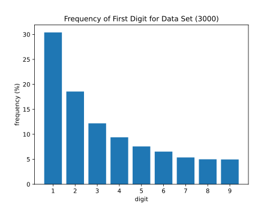

# Testing Benford's Law
This code is for verifying Benford's law with data.

### Code's Theory: Benford's Law
If you take the first digit of every number in a random data set, one would expect the digit to be as a 1 just as frequently as it would be a 9. 
Benford's law says otherwise.
- For an abstract mathematical explanation: [Wolfram Mathworld, "Benford's Law"](https://mathworld.wolfram.com/BenfordsLaw.html)
- For its use in detecting fabricated data:
  - Arguments for using it to detect accounting and election fraud: [Carnegie Mellon blog post, "Benford's Law: Potential Applications for Insider Threat Detection"](https://insights.sei.cmu.edu/blog/benfords-law-potential-applications-insider-threat-detection/)
  - Arguments against: ["Benford's Law and the Detection of Election Fraud"](https://www.jstor.org/stable/23011436)

### Code's Purpose
The code analyzes the first digit of each cell value in a Excel spreadsheet and creates a graph of its frequency.
The graph should converge to a `k/x` graph with larger data sets.

The data I used was the 2020 population for each of the approximately 3143 U.S. counties, which should be found here: ["County Population Totals and Components of Change: 2020-2022"](https://www.census.gov/data/tables/time-series/demo/popest/2020s-counties-total.html).

This what that data created:

### Code's Modifications for Other Data Sets
The items `skiprows` and `usecols` might need to be modified to extract the relevant data for different Excel spreadsheets.

This was also my first time reading from an Excel spreadsheet using Python and my first time graphing using matplotlib. Some methods may not be the most efficient or direct. Thus, this records the history of my learning process. :)
